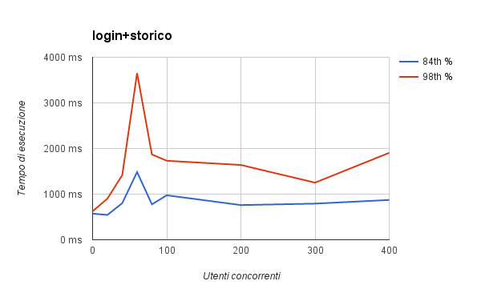
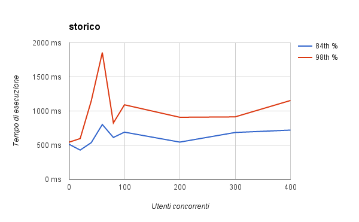

## Runs

> Test eseguiti da istanza t1.micro

---

| Tipo istanza | Numero istanze | Utenti concorrenti |
| ------------ | -------------- | ------------------ |
| m4.large     | 1              | 0 + 1              |

| Scenario      | 84th % | 98th % | Media | SD   | Max  | Min  |
| --------      | ------ | ------ | ----- | ---- | ---  | ---  |
| login         | 75     | 90     | 67    | 8    | 100  | 56   |
| login+storico | 573    | 624    | 501   | 74   | 902  | 414  |
| storico       | 512    | 543    | 442   | 59   | 569  | 357  |

---

| Tipo istanza | Numero istanze | Utenti concorrenti |
| ------------ | -------------- | ------------------ |
| m4.large     | 1              | 20 + 1             |

| Scenario      | 84th % | 98th % | Media | SD   | Max  | Min  |
| --------      | ------ | ------ | ----- | ---- | ---  | ---  |
| login         | 119    | 286    | 78    | 54   | 301  | 37   |
| login+storico | 544    | 902    | 445   | 136  | 930  | 329  |
| storico       | 427    | 596    | 356   | 75   | 630  | 287  |

---

| Tipo istanza | Numero istanze | Utenti concorrenti |
| ------------ | -------------- | ------------------ |
| m4.large     | 1              | 40 + 1             |

| Scenario      | 84th % | 98th % | Media | SD   | Max  | Min  |
| --------      | ------ | ------ | ----- | ---- | ---  | ---  |
| login         | 143    | 514    | 99    | 131  | 1125 | 39   |
| login+storico | 802    | 1416   | 599   | 243  | 1543 | 335  |
| storico       | 536    | 1147   | 426   | 189  | 1574 | 292  |

---

| Tipo istanza | Numero istanze | Utenti concorrenti |
| ------------ | -------------- | ------------------ |
| m4.large     | 1              | 60 + 1             |

| Scenario      | 84th % | 98th % | Media | SD   | Max  | Min  |
| --------      | ------ | ------ | ----- | ---- | ---  | ---  |
| login         | 260    | 863    | 162   | 256  | 1921 | 40   |
| login+storico | 1484   | 3652   | 1006  | 729  | 3707 | 341  |
| storico       | 802    | 1857   | 616   | 408  | 2679 | 297  |

---

| Tipo istanza | Numero istanze | Utenti concorrenti |
| ------------ | -------------- | ------------------ |
| m4.large     | 2 (autoscaled) | 80 + 1             |

| Scenario      | 84th % | 98th % | Media | SD   | Max  | Min  |
| --------      | ------ | ------ | ----- | ---- | ---  | ---  |
| login         | 216    | 922    | 132   | 193  | 1148 | 40   |
| login+storico | 776    | 1870   | 601   | 369  | 2957 | 326  |
| storico       | 612    | 825    | 443   | 155  | 1052 | 290  |

---

| Tipo istanza | Numero istanze | Utenti concorrenti |
| ------------ | -------------- | ------------------ |
| m4.large     | 2 (autoscaled) | 100 + 1            |

| Scenario      | 84th % | 98th % | Media | SD   | Max  | Min  |
| --------      | ------ | ------ | ----- | ---- | ---  | ---  |
| login         | 268    | 897    | 144   | 198  | 1095 | 36   |
| login+storico | 975    | 1731   | 682   | 413  | 3116 | 324  |
| storico       | 690    | 1091   | 506   | 215  | 1187 | 287  |

---

| Tipo istanza | Numero istanze | Utenti concorrenti |
| ------------ | -------------- | ------------------ |
| m4.large     | 10             | 500 + 1            |

| Scenario      | 84th % | 98th % | Media | SD   | Max  | Min  |
| --------      | ------ | ------ | ----- | ---- | ---  | ---  |
| login         | 353    | 1252   | 178   | 293  | 2022 | 35   |
| login+storico | 1017   | 1587   | 697   | 366  | 2524 | 318  |
| storico       | 637    | 1010   | 473   | 180  | 1173 | 290  |

## Progressione

